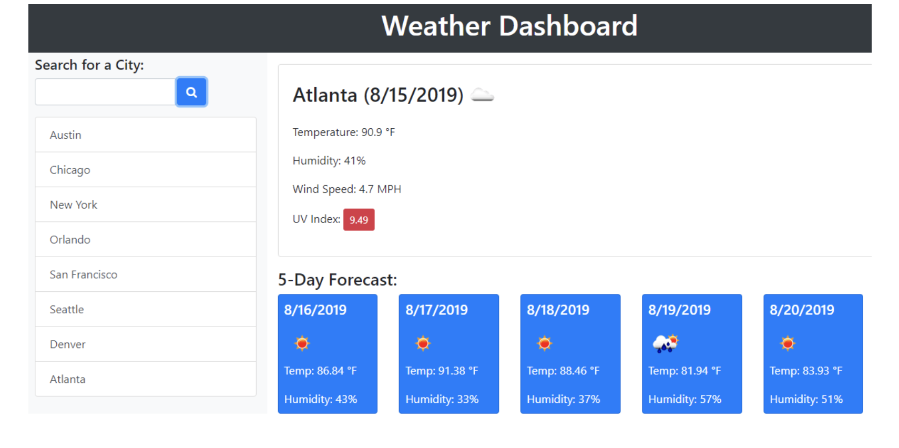

# Show Me the Weather App

## Background

This project is my attempt of creating a weather app using the OpenWeather API to retrieve weather data for current day and five day forecast. The app runs in the browser and features dynamically created HTML and CSS powered by jQuery code. 

The app loads a day or night background based on time of day.

The user can search for a city and will be shown the current day weather data including the UV index with a colour-coded indicator. They will also be shown the five day forecast. 

Each time the user searches, their input is saved to local storage and a dynamically generated search history list is shown; the user can click on the respective city button and is shown the same weather data sets.

Comments were added throughout the Javascript file, highlighting the key coding blocks and evidence of console.log testing. 

[View my final project on GitHub pages](https://rubybassi.github.io/show-me-the-weather-app/)

If you have feedback, please feel free to drop me a comment.

### User Story

> AS A traveler
> I WANT to see the weather outlook for multiple cities
> SO THAT I can plan a trip accordingly

### Acceptance Criteria

> GIVEN a weather dashboard with form inputs
> WHEN I search for a city
> THEN I am presented with current and future conditions for that city and that city is added to the search history
> WHEN I view current weather conditions for that city
> THEN I am presented with the city name, the date, an icon representation of weather conditions, the temperature, the humidity, the wind speed, and the UV index
> WHEN I view the UV index
> THEN I am presented with a color that indicates whether the conditions are favorable, moderate, or severe
> WHEN I view future weather conditions for that city
> THEN I am presented with a 5-day forecast that displays the date, an icon representation of weather conditions, the temperature, and the humidity
> WHEN I click on a city in the search history
> THEN I am again presented with current and future conditions for that city
> WHEN I open the weather dashboard
> THEN I am presented with the last searched city forecast

### Expected Layout Mockup∏

The following image was provided to demonstrate what the web application's layout should resemble, although there was room for customisation:

### My Development Enviromment:
* [Visual Studio Code](https://code.visualstudio.com/)
* Terminal
* [Git](https://git-scm.com/book/en/v2/Getting-Started-Installing-Git)
* [OpenWeatherMap API](https://openweathermap.org/api)
* [Weather App Vectors by Vecteezy](https://www.vecteezy.com/free-vector/weather-app)

